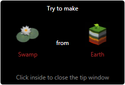

# Alchemy

A small game for Windows written in C# with WPF.

**This game was developed until 2012. There is no new development for the game!**

# Description

Start with four basic elements, Air, Earth, Fire and Water and combine them to create hundreds more.

You start with the four basic elements: air, earth, fire and water. You can combine them by dragging onto each other on the central area of the window, “the desktop”. When new elements are created they are added to the list from the left area. Some of them are terminal elements, which means you cannot combine them again with other elements. These are marked with a blocking icon shown on the bottom-right corner of the image. The non-terminal elements can be dragged from the list to the desktop area. The same effect is achieved by double clicking on them.

# Game walkthrough

You can quickly bring onto the desktop the four basic elements by double clicking on an empty area of it. Double clicking on an element from the desktop creates a duplicate of it. You can remove all the elements from the desktop area by clicking the Clean button.

You can also delete only some elements from the desktop, by first selecting them with the mouse while holding the `CTRL` button pressed. Then, press the `Delete` key to remove them from the desktop. When selected for deletion they are marked with a red border (a white border indicates the current selected element when option Tap to combine is enabled – see below).

When the number of elements gets too big scrolling through the list might be cumbersome. You can use the search textbox to filter the elements in the list. As you type only the elements that contain the typed text are displayed. It you press the X button of the textbox or clear its content, the list displays again all the unlocked elements.

On the right area of the window you find a help pane. When you select an element from one of the two lists on the left side, you can see a list of all the unlocked combinations in which the elements appears (either as input or output).

When you unlock all the elements in the game you are notified with the following window:

There are also several buttons on top of the right area: Hint, Wiki, More, Help and About.

The button `Hints` pops-up a window displaying one possible element you can create, also indicating one of the two elements used to create it. To close the hints window, just click anywhere on it.

The button `Wiki` opens a browser and performs a search with Google on the currently selected element (the one you see on the top of the right side of the window).

The button `More` displays another window that allows you to do different things. You must close this window before you can do anything in the main window (including minimizing the main window).

# Game settings

**Saves Tab**: allows you to save and load the current progress (and the user settings such as language) to/from another file than the default. You can also reset your entire progress from this window, but that will bring you back to scratch. It is recommended that you save your progress to a file before resetting. You can load the file later, even with a later Alchemy version.

**Language Tab**: allows you to select the current language. When you select a new language, it takes effect immediately, but the More window closes automatically. However, since the two lists with the elements are sorted alphabetically, when you change the language the order of the elements in the list also changes.

**Settings tab**: allows to configure the behavior of the game.

Currently there are three available settings (also stored in the user settings file):

- Combine only new: prevents you to make the same combination again, once you found it
- Tap to combine: allows to combine elements by taping on the first and then on the second, instead of dragging them onto each other
- Display timer: show a the total progress time, since the beginning of the game; the timer is only reset when you clear your entire progress and start from scratch

**Cheats tab**: display the list of all available elements (discovered or not).

**Credits tab**: displays a list with the names of those that helped translating Alchemy to other languages than English.

# Languages

The following languages are supported:
- English
- Romanian
- Dutch
- Czech
- Portuguese
- Hungarian
- French
- Danish
- German
- Italian
- Hebrew
- Slovak
- Indonesian
- Spanish
- Polish
- Bulgarian (Cyrillic)
- Serbian (Cyrillic and Latin)
- Russian (Cyrillic)

# Credits

Many thanks for the volunteers from around the world that translated the game to these languages and made the game available for more than one billion native speakers. Great job, thank you. Here is the list of the translators:

- Ruud van der Eem (Dutch)
- Lukas Juda "LKJ" (Czech)
- Bruno Silva (Portuguese)
- Zoltán Perge (Hungarian)
- Fabien Celier “Lord of Dark” (French)
- Jeppe Uhd (Danish)
- Martin (German)
- Leandro Papi (Italian)
- Erez Segall (Hebrew)
- Jozef Krsak (Slovak)
- Pamungkas Atma Saputra (Indonesian)
- Luis Rolando Rodríguez Daza & Eduardo Kucharsky (Spanish)
- Marcin Pawlicki (Polish)
